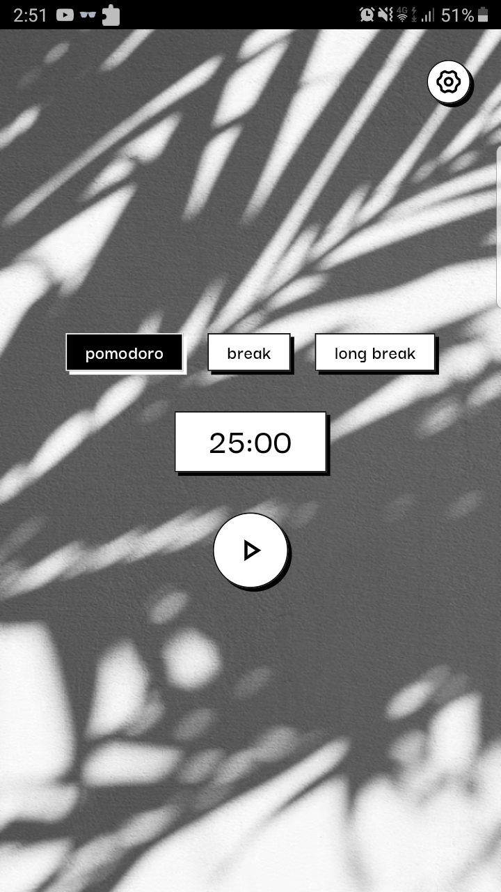
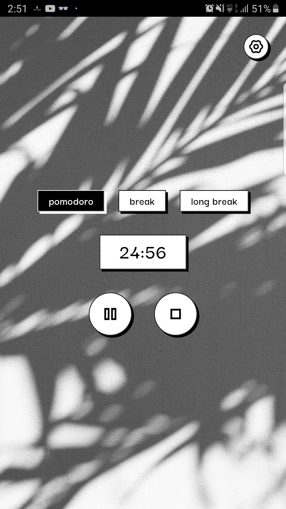
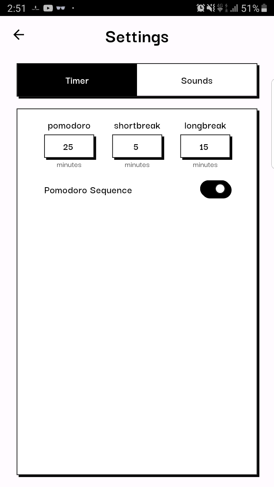
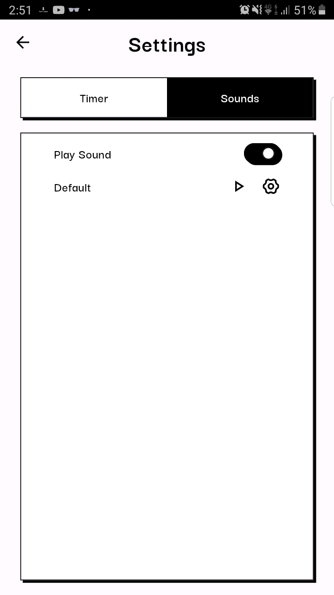
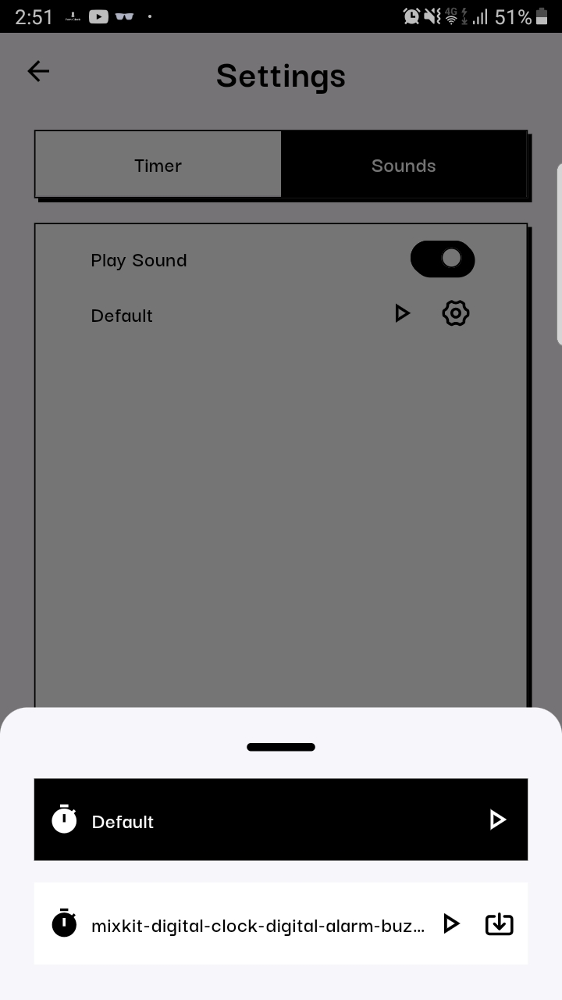

<h3 align="center">PomoClock</h3>
<div align="center">
    
</div>

<br>
<p align="center">PomoClock s a simple Pomodoro Timer Application. It helps users to manage their work or study sessions by providing structured intervals of focused work and breaks, following Pomodoro technique that been proved to be effective.</p>


### Screenshots
<div float="left" align="center">
    
    
    
    
    
</div>

### Things that i've learn through making this application
1. Clean Architecture 
2. Unit Testing
3. Testing Bloc In Flutter
4. You should not use complex architecture for small project

### Error/things that i stumble upon building this project
#### bloc emitting a state, but the UI did not update
##### why ?
i was using the approach below (Trying to create a new Instance of BLoC everytime parent bloc changes/updated) and turns out that is not a recommended approach as the `TimerCounterBloc` is registered as `factory` with `get_it` package, and i was implementing the approach like this:
```dart
return BlocProvider<TimerCounterBloc>.value(
	value: sl<TimerCounterBloc>(param1: state.timer),
	child: const CounterWidget(),
  );
```
it will create a new instance of `TimerCounterBloc` everytime it rebuilds, and the BLoC(`TimerCounterBloc`) that get Provided is not the same as when it is created as first, so the whole UI is not updated.

and if i'm guessing correctly this will also make the application slow as the time goes, because it will create `TimerCounterBloc` instance every time `TimerBloc` state changes, and it will not remove the `TimerCounterBloc` that had been instansiated

##### how to fix it ?
I'm fixing this issue with the recommended way from Bloc website: [bloc-to-bloc communication through domain layer](https://bloclibrary.dev/#/architecture?id=connecting-blocs-through-domain) which is using a **reactive** repositories to store the data, the repositories live inside of `data` layer.

**Why Reactive repositories** ? because i need to store a data that will get used by the `TimerCounterBloc` and `TimerBloc` 

> **Reactive Repository** is a repository that uses the reactive programming paradigm, where data is modeled as streams of events that can be observed and reacted to. It's often used in conjunction with frameworks such as RxJava or RxSwift.
> In a reactive repository, instead of returning a single value from a repository method, the method returns a stream of data that emits events whenever the data changes. This allows the client to subscribe to the stream and receive updates in real-time without needing to poll the repository for changes.

these are the implementation of the **reactive** repositories:
contract/domain layer:
```dart
// domain/repository/timer_storage_repository.dart
import 'dart:async';

import '../entity/timer_entity.dart';

abstract class TimerStorageRepository {
  Stream<TimerEntity> get stream;
  void add(TimerEntity timer);
}
```
implementation/data layer:
```dart
// data/repository/timer_storage_impl.dart
import 'dart:async';

import '../../domain/entity/timer_entity.dart';
import '../../domain/repository/timer_storage_repository.dart';

class TimerStorageRepositoryImpl extends TimerStorageRepository {
  final StreamController<TimerEntity> _controller =
      StreamController<TimerEntity>();

  @override
  void add(TimerEntity timer) {
    _controller.sink.add(timer);
  }

  @override
  Stream<TimerEntity> get stream => _controller.stream.asBroadcastStream();
}
```

so right now we have an reactive repository that we can listen to, so in the 2 bloc `TimerBloc` and `TimerCounterBloc` i just need to listen/add the data when i need to.

like this example of implementation inside `TimerCounterBloc`: 
in the `TimerCounterBloc` i have a function that will listen into the `StreamController` that `TimerStorageRepository` had, so when the `TimerBloc` add the data, this `listen` function will trigger and change `timer` variable, etc inside of `TimerCounterBloc` instance and finally `emit` a `TimerCounterInitial` state
```dart
// presentation/bloc/timer_counter/timer_counter_bloc.dart

// constructor
TimerCounterBloc() {
	_subcribeTimer();
}

void _subscribeTimer() {
	_timerSubscription = _getStorageTimerUsecase().listen((data) {
	  // cancel countdown subscription
	  _countdownSubscription?.cancel();
	
	  timer = data;
	
	  // will change _duration value
	  _setDurationByType();
	
	  // ignore: invalid_use_of_visible_for_testing_member
	  emit(
		TimerCounterInitial(timeConverter.fromSeconds(_duration)),
	  );
	});
}

```

#### Trying to create a new Instance of BLoC everytime parent bloc changes/updated

So i had 2 BLoC class `TimerBloc` & `TimerCounterBloc` and `TimerCounterBloc` accept `TimerEntity` in the constructor, the `TimerEntity` is coming from the `TimerBloc` so when the `TimerBloc` get updated, it should also update the `TimerCounterBloc` with the updated `TimerEntity`. The first attempt that i already tried are:
```dart
if(state is TimerLoaded) {
	return BlocProvider(
		create: (_) => TimerCounterBloc(timer: state.timer),
		child: ...
	);
}
```

code above will only create an `TimerCounterBloc` once, and everytime the `TimerBloc` get updated, it will not create a new instance of `TimerCounterBloc`, so the `timer` fields inside of `TimerCounterBloc` will not get updated.

##### What to do ?
we can create a new instance/object of `TimerCounterBloc` everytime `TimerBloc` get updated or `TimerLoaded` from `TimerBloc` get emitted. Since we already created a new instance of `TimerCounterBloc` to use the new instance we need to use `BlocProvider.value` constructor instead of the normal `BlocProvider` because we already had an instance of a BLoC with a `BlocProvider.value` constructor we can use **pre-existing** BLoC like shown below.

```dart
if(state is TimerLoaded) {
	/// Will Create a new instance of TimerCounterBloc everytime this block of code get executed.
	final timerCounterBloc = TimerCounterBloc(timer: state.timer);

	/// Will use the pre-existing of timerCounterBloc that just been created.
	/// so it will provide a `TimerCounterBloc` with the new `timer` field.
	return BlocProvider.value(
		create: timerCounterBloc,
		child: ...
	);
}
```
#### Trying to emit a new state when BLoC EventHandler already finished.
When i try to listen to a Stream (Stream.periodic in specific) inside of a bloc, and every Event added in a Stream(Stream.periodic) i try to emit a new State like this:
```dart
  void _onTimerStarted(TimerStarted event, Emitter<TimerState> emit) async {
    _countdown.count(event.duration).fold(
      (err) => emit(TimerFailure(err.toString())),
      // this part below.
      (data) {
        data.listen((event) => emit(TimerInProgress(event)));
      },
    );
  }
```
\_countdown.count will return an `Stream<int>`(stream.periodic) and after getting the `Stream<int>` i tried listening to it, and every event changes inside `Stream` i emit `TimerInProgress`, it will cause an error, because `_onTimerStarted` method has already finished doing it's job (executing), and the code trying to emit a new state `TimerInProgress`  after the method is already finished executing (because i'm listening to the stream Stream.listen).

##### how do I fix it ?
In this case, instead of emitting a new State every event changes inside `data`(stream) we can **add/register new Event to handle the new state** 
```dart
_onTimerStarted(TimerStarted event, Emitter<TimerState> emit) async {
    _countdown.count(event.duration).fold(
          (err) => emit(TimerFailure(err.toString())),
          (data) => data.listen((d) => add(_TimerTicked(duration: d))),
        );
}

_onTimerTicked(_TimerTicked event, Emitter<TimerState> emit) {
	emit(TimerInProgress(event.duration));
}
```
so because we listen to the **Stream<int\>**(stream.periodic) we will **add/register new event `(_TimerTicked)`** everytime `data`**Stream<int\>** changes, and the BLoC will handle when `_TimerTicked` event get send using `_onTimerTicked` and inside of that handler/function we `emit` a new state.


So the flow will be:
1. \_onTimerStarted will be finished and we listen to the stream(`data`)
2. and everytime the stream changes/emitting something we **register/add** `_TimerTicked` event
3. and when the `_TimerTicked` got sent , we handle it by using `_onTimerTicked` function that emit a `TimerInProgress` state.
